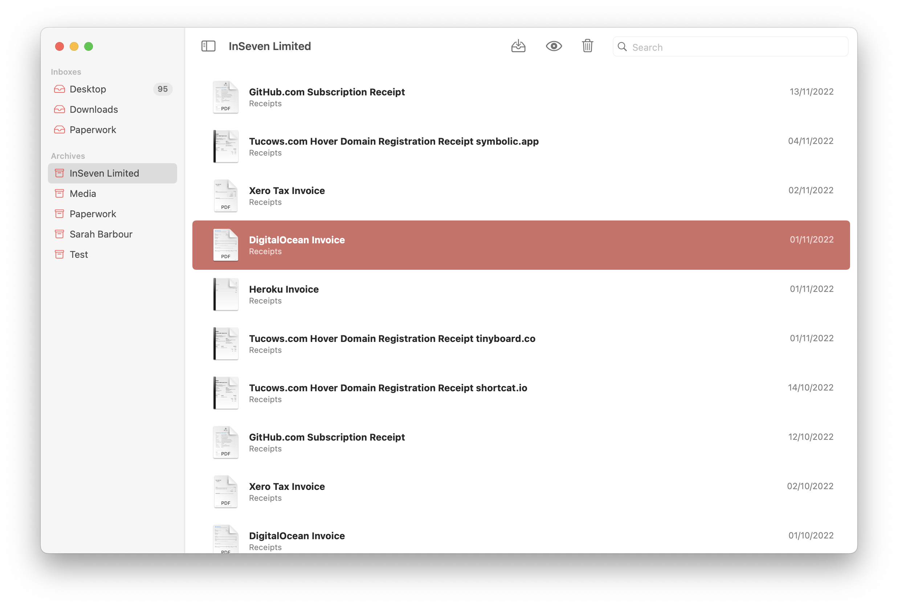

# Fileaway

[](https://github.com/jbmorley/fileaway/actions/workflows/build.yaml) [](https://github.com/inseven/fileaway/actions/workflows/update-release-notes.yaml)

Document management app for iOS and macOS.



## Overview

Right now the macOS and iOS apps are incredibly divergent having been written with significantly different ideas of what makes for a good file management app: the iOS came first and focuses solely on the process of rule based filing, while the latest iteration of the macOS app (there have been many) also introduces a Mail-like file browser.

## Development

Fileaway follows the version numbering, build and signing conventions for InSeven Limited apps. Further details can be found [here](https://github.com/inseven/build-documentation).

### Builds

In order to make continuous integration easy the `scripts/build.sh` script builds the full project, including submitting the macOS app for notarization. In order to run this script (noting that you probably don't want to use it for regular development cycles), you'll need to configure your environment accordingly, by setting the following environment variables:

- `APPLE_DEVELOPER_ID` -- individual Apple Developer Account ID (used for notarization)
- `NOTARIZE` -- boolean indicating whether to attempt notarize the build (conditionally set based on the current branch using `${{ github.ref == 'refs/heads/main' }}`)
- `TRY_RELEASE` -- boolean indicating whether to attempt a release (conditionally set based on the current branch using `${{ github.ref == 'refs/heads/main' }}`)
- `GITHUB_TOKEN` -- [GitHub token](https://docs.github.com/en/github/authenticating-to-github/creating-a-personal-access-token) used to create the release

The script (like Fastlane) will look for and source an environment file in the Fastlane directory (`Fastlane/.env`) which you can add your local details to. This file is, of course, in `.gitignore`. For example,

```bash
# Certificate store
export MATCH_PASSWORD=
export CERTIFICATE_REPOSITORY=
export CERTIFICATE_REPOSITORY_AUTHORIZATION_KEY=

# Developer account
export APPLE_DEVELOPER_ID=
export FASTLANE_APPLE_APPLICATION_SPECIFIC_PASSWORD=

# GitHub (only required if publishing releases locally)
export GITHUB_TOKEN=
```

You can generate your GitHub authorization key (for `CERTIFICATE_REPOSITORY_AUTHORIZATION_KEY`) as follows:

```bash
echo -n your_github_username:your_personal_access_token | base64
```

Once you've added your environment variables to this, run the script from the root of the project directory as follows:

```bash
./scripts/build.sh
```

You can notarize local builds by specifying the `--notarize` parameter:

```bash
./scripts/build.sh --notarize
```

You can publish a build locally by specifying the `--release` parameter:

```bash
./scripts/build.sh --release
```

## Licensing

Fileaway is licensed under the MIT License (see [LICENSE](LICENSE)).

During development, the plan is to make builds available for free through the [Releases](https://github.com/jbmorley/fileaway/releases) section of the GitHub project. Once we reach something robust and ready for release, we'll make a paid version available through the [App Store](https://www.apple.com/app-store/) to fund on-going costs of development. The app will remain Open Source, and anyone is free to contribute or build their own copies, and we'll figure out a way to give free licenses to contributors.
