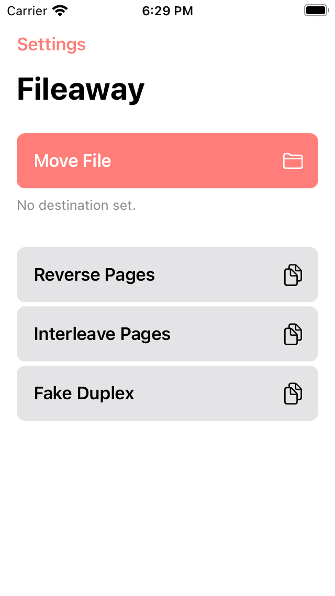

# Fileaway

Document management app for iOS and macOS.

## Overview

Right now the macOS and iOS apps are incredibly divergent having been written with significantly different ideas of what makes for a good file management app: the iOS came first and focuses solely on the process of rule based filing, while the latest iteration of the macOS app (there have been many) also introduces a Mail-like file browser.

## Changelog

### macOS 0.1.0

Initial release with support for a single inbox and archive directories, rules wizard, and simple rule editing.

## Licensing

Bookmarks is licensed under the MIT License (see [LICENSE](LICENSE)).

During development, the plan is to make builds available for free through the [Releases](https://github.com/jbmorley/bookmarks/releases) section of the GitHub project. Once we reach something robust and ready for release, we'll make a paid version available through the [App Store](https://www.apple.com/app-store/) to fund on-going costs of development. The app will remain Open Source, and anyone is free to contribute or build their own copies, and we'll figure out a way to give free licenses to contributors.
